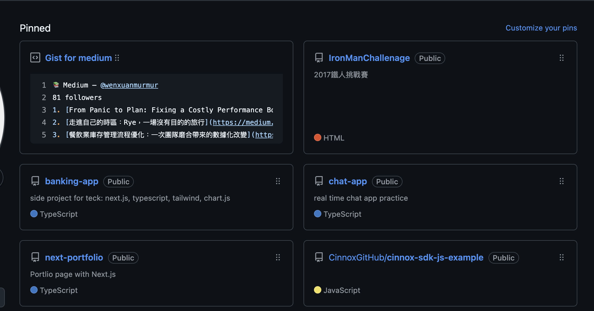

# Medium Status Pinned



A tool to pin your latest Medium status (articles, highlights, etc.) to your GitHub profile or other places, using Gist and Medium RSS.

## Features
- Fetch your latest Medium articles or highlights
- Update a GitHub Gist with your Medium status
- Automate the process with scripts

## Getting Started

### 1. Fork & Clone
Fork this repository, then clone it to your local machine:

```sh
git clone https://github.com/<your-username>/medium-status-pinned.git
cd medium-status-pinned
```

### 2. Install Dependencies

```sh
npm install
```

### 3. Configure Environment

You may need to set up environment variables or edit the code to add your Medium username and GitHub Gist credentials. Check the `src/medium.ts` and `src/gist.ts` files for configuration points.

### 4. Build & Run

To build the TypeScript code:

```sh
npm run build
```

To run the tool:

```sh
npm start
```

Or, directly with ts-node (if installed):

```sh
npx ts-node src/index.ts
```

## Customization
- Edit `src/medium.ts` to change how Medium data is fetched.
- Edit `src/gist.ts` to change how the Gist is updated.
- Edit `src/readme.ts` if you want to update a README file instead.

## Contributing
Pull requests are welcome! For major changes, please open an issue first to discuss what you would like to change.


